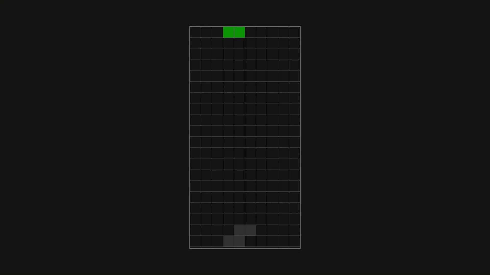

# Browser Tetris

A minimalist Tetris game built using HTML, CSS, and vanilla Javascript.

This repo includes only the core functions of https://github.com/eve-1010/tetris-in-browser, which was developed for a school project.

## Features

- **Standard tetrominos**: All 7 pieces with standard color scheme.
- **Ghost piece**: A shadow showing where the current piece will land.
- **Hard drop**: Drop the piece instantly to the ghost piece's position.
- **Hold piece**: Temporarily store a piece for later use.
- **Pause screen**: Accessible with the Escape key.

This implementation does not contain:
- Title screen
- Hold and preview pane
- Instructions pane
- Background music
- Timer
  
which are available over at the [original repo](https://github.com/eve-1010/tetris-in-browser).

## Usage

A running instance is available through this [link](https://eve-1010.github.io/browser-tetris/). Alternatively, clone this repo and open `index.html` in your browser to play.

## Preview

## Controls

This game supports keyboard input only.

|Key|Function|
|---|---|
|Arrow up|Rotate|
|Arrow down|Soft drop|
|Arrow left|Move left|
|Arrow right|Move right|
|Space|Hard drop|
|C or Shift|Hold|
|Esc|Pause game|

## License

This software is licensed under the [MIT License](https://github.com/eve-1010/browser-tetris/blob/main/LICENSE) © [Cha](https://github.com/eve-1010)
